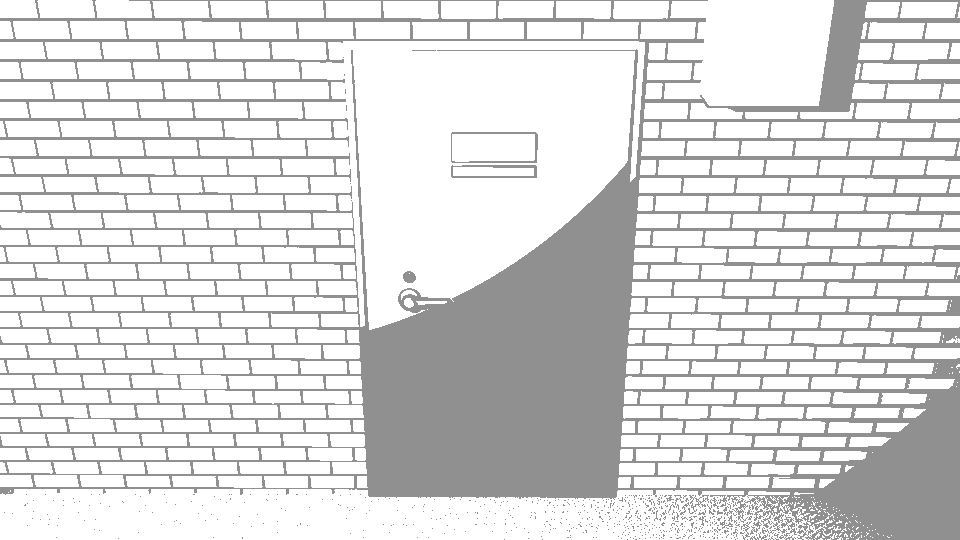
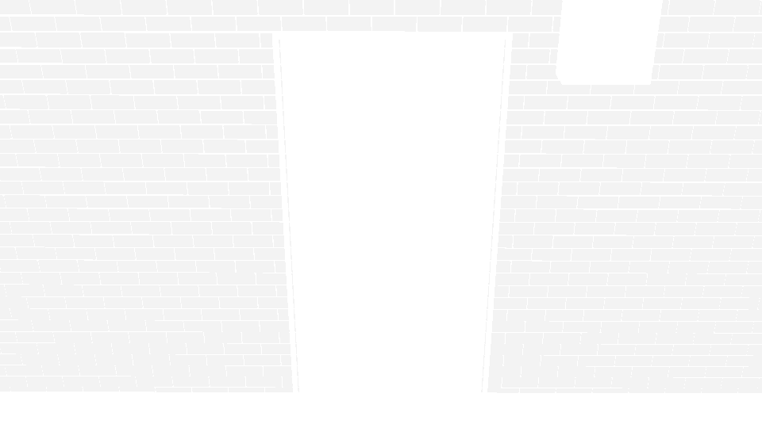
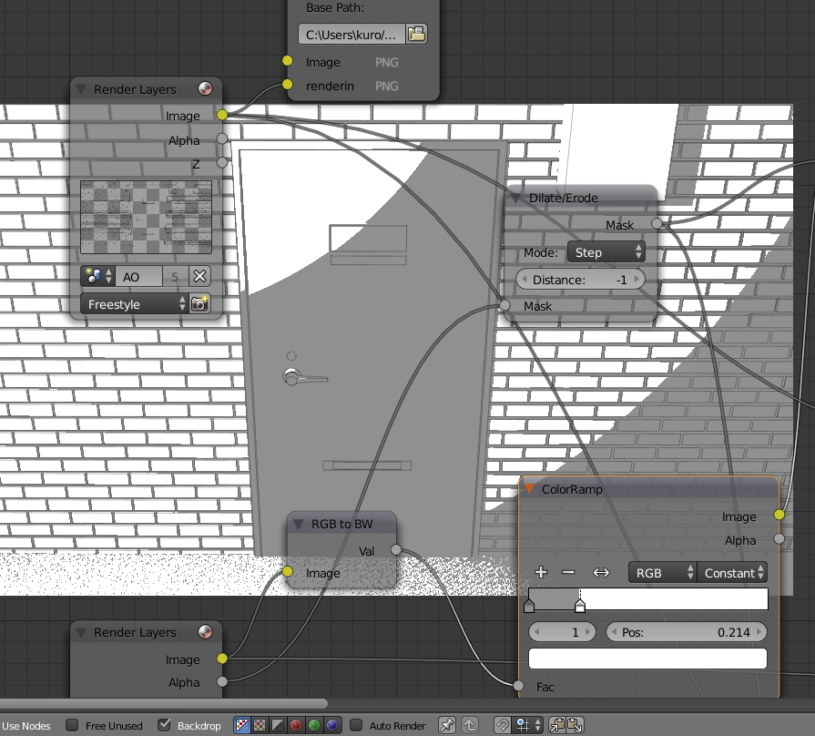
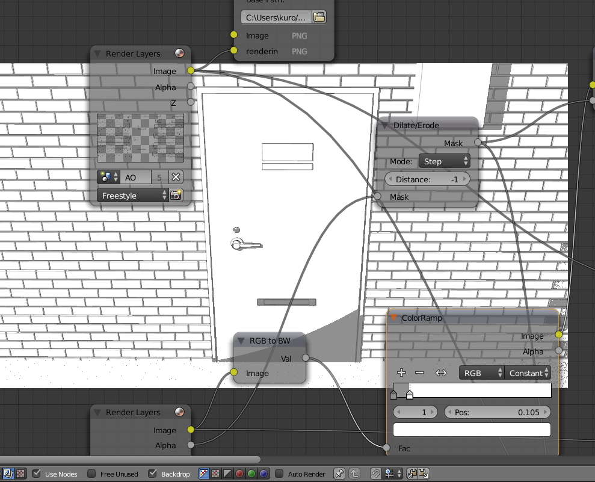
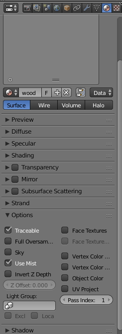
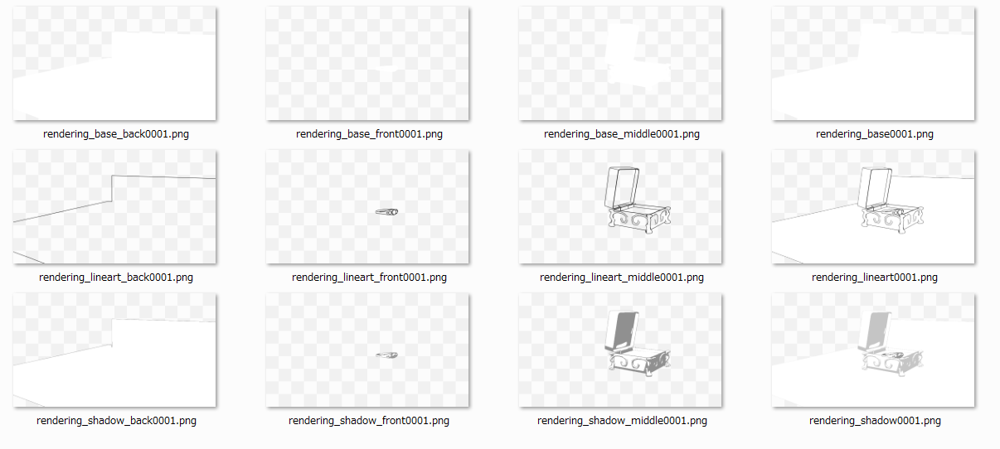

# blender-lineart-node
this repository is scripts for blender.  

blender の、主に漫画背景制作用途に作ったスクリプトです  
# comicLineartNode.py / comicLineartNodeDivided.py  
レイヤを使って前中後景に別々にレンダリングします。手前側、奥側と言ったふうに分離することでキャラが間に挟まる構図に使えると同時に、情報量が多いデータの場合でも、blender が落ちるリスクを軽減できると考えています 
  
comicLineartNode.py １枚の画像としてレンダリング処理します（殆どの場合コレで問題ないと思います)  
comicLineartNodeDivided.py 3枚の前中後の画像としてレンダリング処理します  
comicLineartGroup.py  使用するノードグループ生成  
comicLineartMulti.py ノード生成に関係なさそうな処理を分けました。出力先フォルダの指定はここでやっています 
  
comicLineartAO.py AO出力用ノードを生成します（すでに同スクリプトにて生成済みの場合、再生成します）node を生成後に、新たにsceneにオブジェを追加した場合、再生成しないとao 出力画像に反映されません    

  
addon になっています  
実行すると レンダリング設定用のノードを生成します  
出力先はデスクトップの rendering/1 フォルダに設定されます  
レンダラーを Blender Render に自動設定されます  
  
解説動画  
https://www.youtube.com/watch?v=9hE5PdFVeTA&t=2s  
  
|file name| 出力される画像|
|:-----|:----------|
| rendering_base001 | Material Pass Index に準じた基本配色|
| rendering_AO001 | Ambient Occrusion のみ|
|rendering_lineart001| 線画のみ|
|rendering_shadow001| 陰影のみ|
|rendering_tex001| texture image を割り振ったオブジェクトのみ|

### 作成の経緯
単純に一枚の画像にレンダリング出力されると、clip studio paint で作業する際に不便を感じることが多かったため、後処理の利便の向上のために作成しました  
ex.
- この線だけ太くしたい
- 基本配色部分だけ薄くしたいor濃くしたい
- 陰影を（物理法則通りではないけど、見た目上よくするために）調整したい

### 陰影の調整
node editor の colorRamp node で調整します  

  
backdrop を on にしておくと楽です  

現状、ランプは点光源一つを前提としています  
複雑な光源の配置や、cycles render でも利用は可能です

### material pass index の関係
material pass index は properties -> material -> options -> pass index で設定します  
マンガ原稿側で、10% トーンを割り振るマテリアルに pass index を 1に、 20% を割り振るマテリアルに pass indx を 2に、という具合に割り振ります。（現状、1:10%, 2:20%, 3:30%, 4:40% に対応付けしてあります）  

### layer による前景・中景・後景に分解
1-5番目のレイヤに属するオブジェクトを中景、6-10番目のレイヤに属するオブジェクトを背景、11-15番目のレイヤに属するオブジェクトを手前側の前景としてレンダリング出力し、最終的に合成したものを出力します。16-20番目のレイヤに属するオブジェクトはすべてのレンダリング画像に作用します（ランプなどを配置）

それぞれに分割レンダリングすることにより、いっぺんにやるよりも負荷を抑えます  
また、前景・後景の間にキャラクターの絵が入る場合、マンガ制作ソフト側で扱いやすくなります  
  
### line style の設定
現状は前景線画を5.5 / 中景 2.2 / 後景 1.1 として freestyle_front|freestyle_middle|freestyle_back という名前のline style を生成して割り振っています.linestyle modifier の along strokeに使用する curve object を apiからは作ることができないようだったので、スクリプトからの生成は見送りにしています.実用上、line style はimport /append やｆ初期設定ファイルから使用したほうがよいと考えているのでここは当面踏み込まないでおく方針です
  
  
# comicLineartNodeAO.py
comicLineartNode.pyの前のバージョン  
AO画像用に scene を複製するため、スクリプト実行後にオブジェを追加するとAO出力にはオブジェが反映されないという問題があります   
  
# proxify.py
addon になってます
link して取り込んだデータを proxy に変換し、group にまとめます  
大量に背景用オブジェをインポートするときのためのものです
TODO 
- [ ] 取り込む際の file 名を group 名に自動で割り振る

# softenMirrorMergeLimit.py / softenArrayMergeLimit.py
ミラー/アレイ モディファイアのマージリミットを一括して設定します。
TODO
- [ ] 現在アクティブなオブジェクト群のみを対象にする

# その他のファイル
makeLineart.py 線画変換用の初期バージョン  
comicResources.py 漫画背景用データ出力の別バージョン（不使用）  
saveName.py ちょっとした文字列データをテキストブロックに保存するため。そのうち改良したい  
whiteMaterialize.py 元々あるマテリアルとランプを全て削除し、まっさらのマテリアルを割り振りします　　
